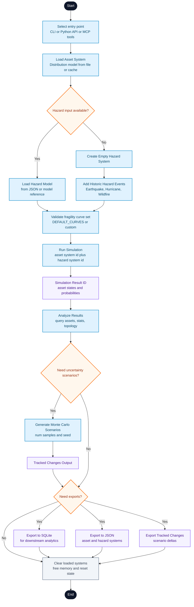

 •  •  •  •  •  •  •  •  •  • 

 

# ERAD (<u>E</u>nergy <u>R</u>esilience <u>A</u>nalysis for electric <u>D</u>istribution systems)

[Visit full documentation here.](https://nlr-distribution-suite.github.io/erad/)

ERAD is a free, open-source Python toolkit for assessing distribution-system asset resilience under hazard scenarios. It models physical infrastructure using graph-based connectivity and computes hazard-specific exposure and survival probabilities for assets such as poles, lines, cables, transformers, substations, junction boxes, switches, and rooftop solar installations. Asset fragility curves relate hazard severity to failure probability for power-system components using relationships established in the literature for flood, wind, wildfire, and earthquake conditions.

ERAD is designed for researchers, students, utilities, and other stakeholders who want to evaluate the performance of electric distribution systems under extreme events and compare asset hardening or mitigation strategies. It supports scenario-based analysis, uncertainty sampling, and export of asset-level results for downstream analysis and system comparison. It was funded by the National Laboratory of the Rockies (NLR) and made publicly available with an open license.

